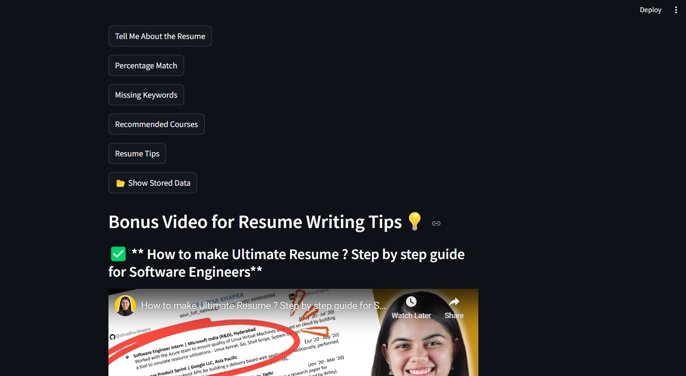
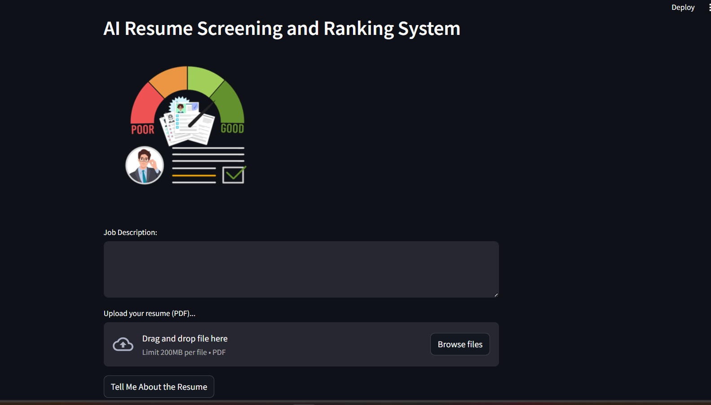
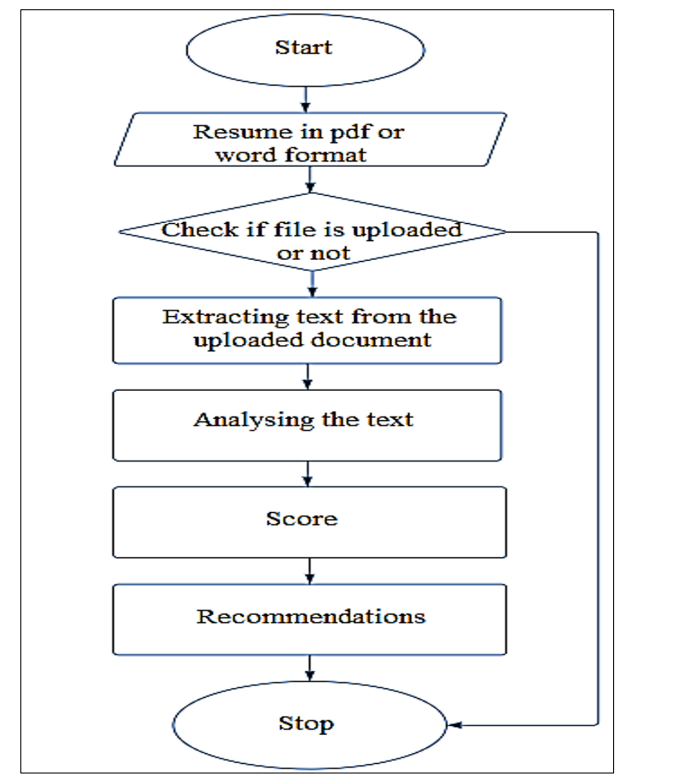

# AI-Resume-Screening-Ranking-System-Python
## 📌 Overview
This project is an **AI-powered resume screening system** that helps job seekers optimize their resumes and assists recruiters in quickly analyzing candidates. It extracts text from a resume, compares it with a given job description, and provides useful insights such as:


- **Tell Me About The Resume** 
- **Resume Match Percentage**
- **Missing Keywords**
- **Recommended Skills and Courses**
- **Resume Improvement Tips**
- **Resume improvement Bonuns videos**

## 🚀 Features
✅ Upload resume (PDF format)
✅ AI-powered resume analysis
✅ Job match percentage calculation
✅ Identify missing keywords
✅ Suggest recommended skills and courses
✅ Resume improvement tips
✅ Store user data in MySQL
✅ Display learning videos for resume writing and interview preparation

## 🛠️ Technologies Used
- **Python** - Main programming language
- **Streamlit** - Web app framework
- **MySQL** - Database for storing resume scores and recommendations
- **Google Gemini AI** - AI-powered resume analysis
- **Pandas** - Data handling and processing
- **PyPDF2** - Extracts text from uploaded PDFs
- **Pillow (PIL)** - Handles images
- **dotenv** - Manages API keys securely

## 📂 Project Setup
### 1️⃣ Install Dependencies
```bash
pip install -r requirements.txt
```

### 2️⃣ Set Up Environment Variables
Create a **.env** file and add your Google API Key:
```env
GOOGLE_API_KEY=your_google_api_key_here
```

### 3️⃣ Run MySQL Server
Make sure MySQL is running and create a database named **sra**.

### 4️⃣ Run the Application
```bash
streamlit run app.py
```
### User Interface


## 📌 How It Works

1. **User Inputs**
   - The user uploads a resume (PDF) and provides a job description.
2. **Resume Processing**
   - The system extracts text from the resume.
   - Sends it to **Google Gemini AI** for analysis.
3. **AI Analysis & Output**
   - Calculates **job match percentage**.
   - Identifies **missing keywords**.
   - Suggests **relevant courses** to learn.
   - Provides **resume improvement tips**.
4. **Store Data in MySQL**
   - Saves resume scores, skills, and recommendations for future use.
5. **Additional Features**
   - Shows **resume writing** and **interview tips** videos from YouTube.

## 📊 Database Schema (MySQL)
The project creates a table named **user_data** with the following fields:
| Column Name           | Data Type         | Description                          |
|----------------------|------------------|----------------------------------|
| ID                  | INT (Primary Key) | Unique user ID                     |
| Name                | VARCHAR(100)      | User's name                        |
| Email_ID            | VARCHAR(50)       | User's email                        |
| Resume_Score        | VARCHAR(8)        | Resume match percentage            |
| Timestamp           | VARCHAR(50)       | Time of analysis                   |
| Page_No             | VARCHAR(5)        | Number of pages in resume          |
| Predicted_Field     | VARCHAR(25)       | Predicted job field                |
| User_Level          | VARCHAR(30)       | User's experience level            |
| Actual_Skills       | VARCHAR(300)      | Skills detected in resume          |
| Recommended_Skills  | VARCHAR(300)      | AI-suggested skills                |
| Recommended_Courses | VARCHAR(600)      | Suggested courses                   |

## 🎯 Future Improvements
- Integrate with **job portals** for automatic job recommendations.
- Provide **customized interview questions** based on resume.
- Use **more AI models** for better resume analysis.

## 💡 Contribution
Feel free to fork this repo, add improvements, and make a pull request! 🚀

## 📜 License
This project is open-source and free to use.

---

**Made with ❤️ by Shadab Khan**

